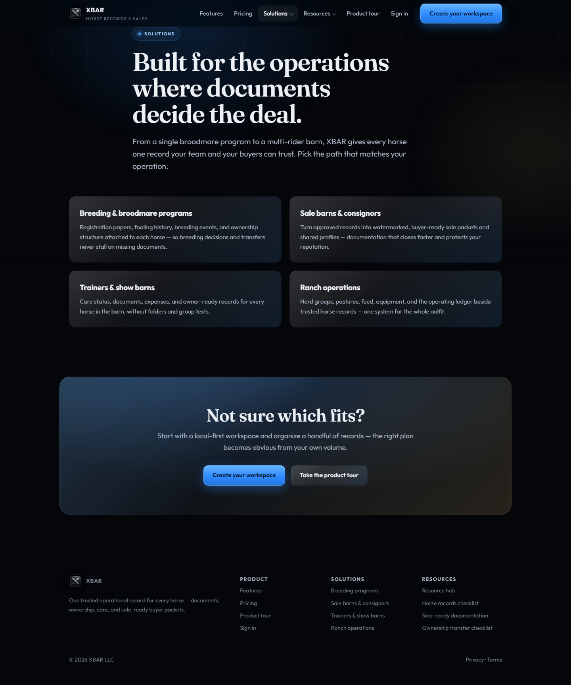
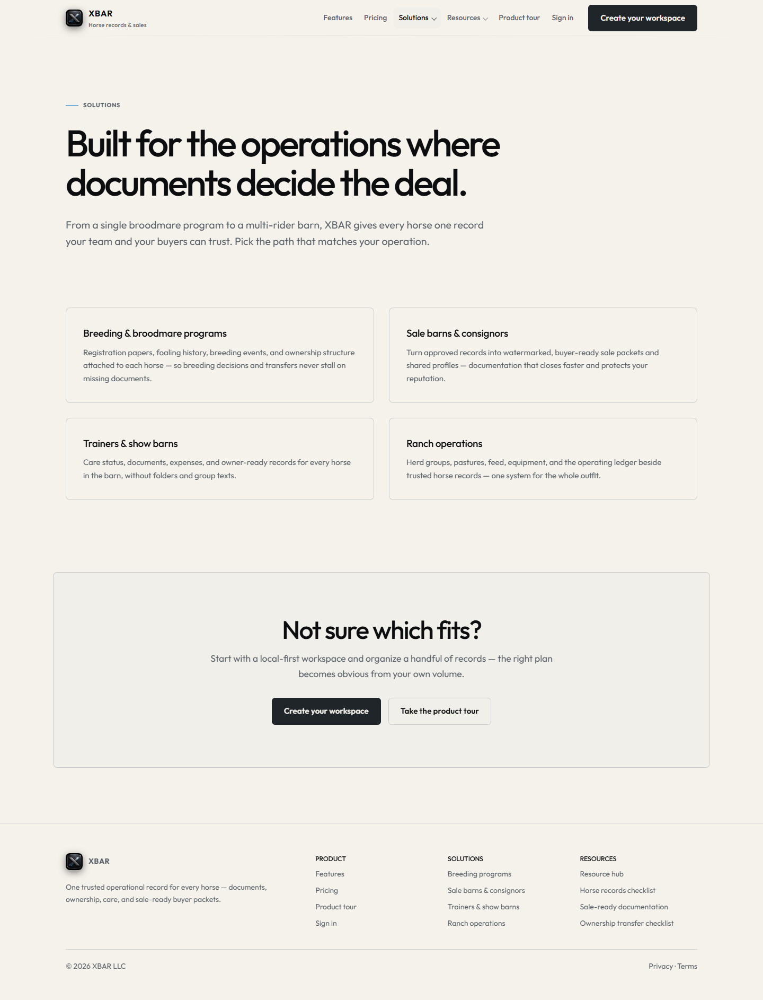
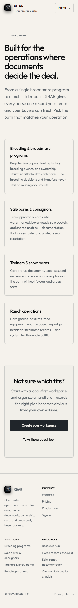
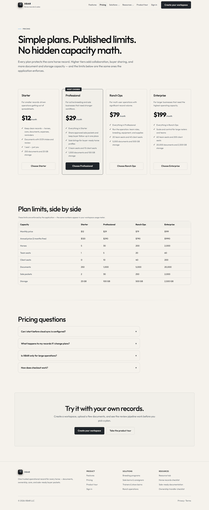

# Public light theme review

Baseline: `90c3cd1fa7e9ffba7e5438ac2b427941c3670421` (September 24, 2026).

Clicking Solutions from the approved light homepage changed the background from
`rgb(245, 242, 236)` to `rgb(4, 6, 10)`. The new browser navigation regression
failed against that production baseline before implementation.

Secondary static pages now use the original XBAR brand tokens, Outfit headings,
warm-white surfaces, gunmetal buttons, restrained blue accents and more whitespace.
The shared header renders the native mobile menu on these pages as well. The
homepage keeps its existing layout, artwork and animation; app routes and the
sample report document are outside this change. No dependencies were added.

## Visual comparison

Screenshots use reduced motion, desktop 1440px and mobile 360px. The before image
is the production baseline; after images are the local production build.

## Validation and release boundary

- Full unit suite, TypeScript, ESLint (four existing warnings, zero errors),
  Prettier and production build passed. The marketing renderer was rebuilt and
  its five unit cases rerun after adding the shared palette link.
- All 20 focused production browser cases passed with retries disabled: the 15
  existing homepage cases and five new public-theme cases. The new cases cover
  all 15 secondary routes at desktop/mobile widths, dark OS preference, footer
  and scrolled-header colors, navigation to Pricing, no-JavaScript signup and
  short-height menus without dynamic viewport units or CSS color mixing.
- Visual inspection covered Solutions, Pricing and the records guide at both
  widths. The initial browser pass caught the missing shared token stylesheet;
  this was fixed before the final passing run.

These checks do not certify physical Safari devices, checkout transactions or
authenticated application workflows. Final remote checks and an exact Vercel
preview are required. Erin's visual approval is required before merge; approval
of the earlier homepage does not approve this expansion. Draft #246 stays
separate and must reconcile its pricing styles before any future release.
