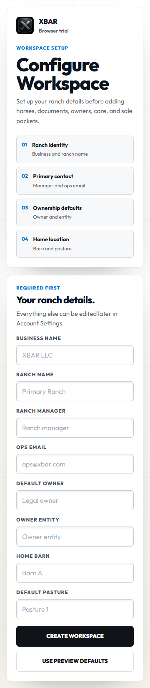
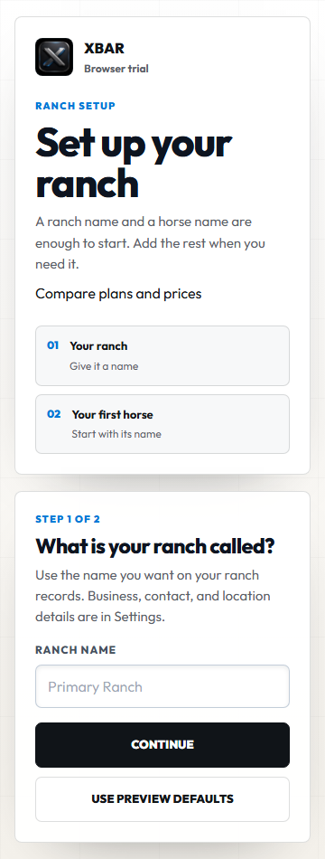
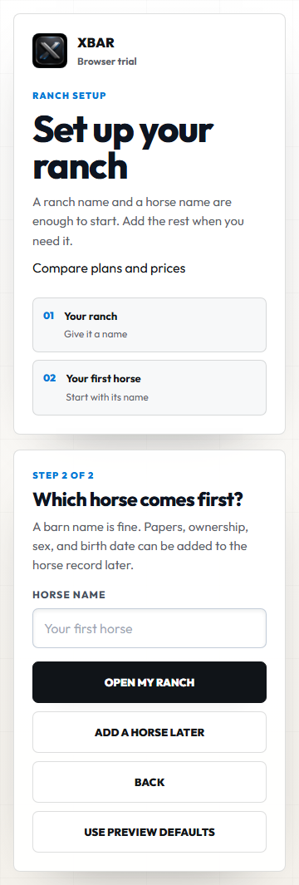
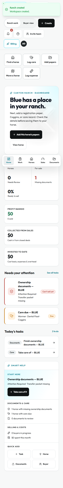
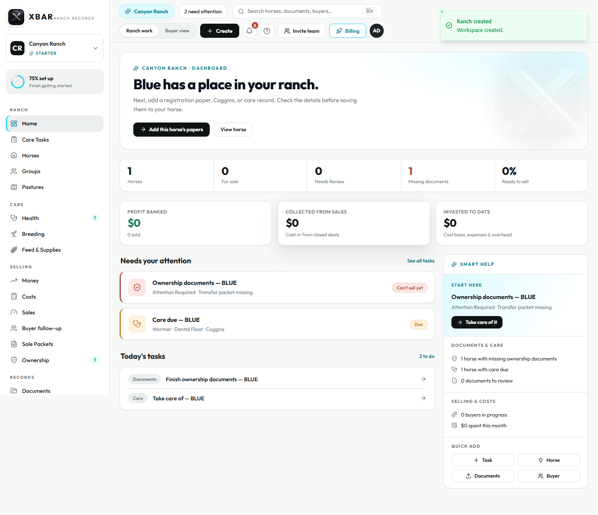
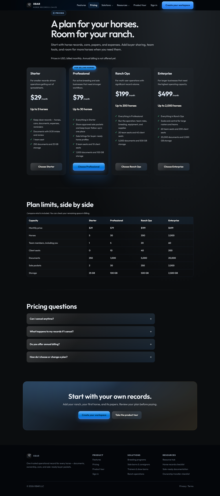

# First four rancher improvements

Baseline: `main` at `59205e98d5a2b396551a6ed147e3027ee56a307d`.

This implements Erin's ordered first batch: plain language, public pricing, shorter setup, and mobile field controls. Later backlog items are outside this PR. No migrations, new services, payment rules, or production configuration changes.

## Copy and pricing

[Review every wording change](rancher-language-changes.md) before approving the copy. Existing routes and stored state keys stay intact. Technical support diagnostics and legal text retain their precise meaning.

Public `/pricing` uses the existing plan definitions: Starter $29, Professional $79, Ranch Ops $199, Enterprise $499 per month. Annual prices and discounts remain unset and the page says so. Its signup links preserve the selected plan into Billing and the existing authenticated Stripe checkout. Existing subscribers use Manage billing to avoid a second subscription. Actual Stripe purchase, cancellation, portal options, and webhook settlement are not established by the UI tests; Stripe connector access needs reconnection to finish that audit. PR #245 separately owns the Starter bullet clarification; this PR clarifies that table seat counts include the owner.

## Setup and records

Two screens ask for ranch name and first horse name. A new horse appears on Home with a button to add its papers. People importing their first horse from documents can still choose Add a horse later. Business, contacts, owners, barn, and pasture remain in Settings; identity and care details remain available when editing a horse or recording care/moves. Selected-plan and requested-page links still return to their original destination after setup.

The name-only horse deliberately uses Not recorded sex, Unassigned group, and New record status. It has no claimed owner/share, registration, parentage, foaling date, or invented compliance deadline. No database enum or migration is added. Setup updates ranch and horse together; retrying cloud save preserves the same horse and ID. Existing configured ranches return to their requested screen instead of running setup again. Cloud-save errors still block setup completion; sign-out failures remain visible.

## Mobile screens changed

| Screen                                           | Change at widths up to 760px                                                                                                      |
| ------------------------------------------------ | --------------------------------------------------------------------------------------------------------------------------------- |
| Home                                             | Five shortcuts: find a horse, log care, add papers, move a horse, log expense. Write shortcuts follow existing role capabilities. |
| Horse, care, document, movement, expense drawers | Primary buttons and fields at least 48px high; inputs use 16px text; text areas are taller; footer accounts for device safe area. |
| App shell, lists and cards                       | Muted text uses the stronger existing text color; primary tabs/navigation/buttons have larger targets.                            |
| Login and setup                                  | Existing controls have a 48px minimum and 16px input text.                                                                        |
| Pricing                                          | Readable mobile plan cards, 48px CTAs and FAQ controls, horizontally scrollable comparison table.                                 |

The new shortcut bar is hidden on desktop; desktop app layouts are unchanged. The public pricing layout and two-step setup are separately requested changes on all screen sizes.

## Verification and limits

Review follow-up: the initial local creator no longer receives the invented `workspace-admin@xbar.local` email. Unknown local email is kept blank and labeled in Settings; the owner member ID and reserved seat survive reload. Cloud creation seeds the actual authenticated account email. A regression test failed on the fabricated address before the correction. Pastures now prompts for the deferred location settings when empty, and its existing detail-drawer test enters that pasture through Settings first.

Focused browser tests cover the two-name flow, unknown identity fields, linking the next document to the correct horse, reload/retry preservation, five 360px shortcuts, real drawer target sizes, no overflow, role-restricted shortcuts, and desktop shortcut hiding. Pricing tests verify four canonical prices and plan-preserving signup links, FAQs, and mobile overflow. Existing setup helpers now use the explicit skip option so intake tests continue to begin with an empty ranch.

Both mixed-PDF OCR regression cases passed after replacing a shared dependency junction with an isolated install. The shared Vite cache had caused an invalid PDF worker URL during an earlier local run. This was a test-environment correction; the OCR implementation is unchanged. It does not prove acceptance against Erin's actual registry document.

Visual review used fictional Canyon Ranch / Blue records only, with desktop 1440px and mobile 360px captures. Evidence is attached below. This PR remains a preview until Erin approves the visual changes and final-head review/checks pass.

### Setup before and after (360px)

### Home after setup

### Public pricing

